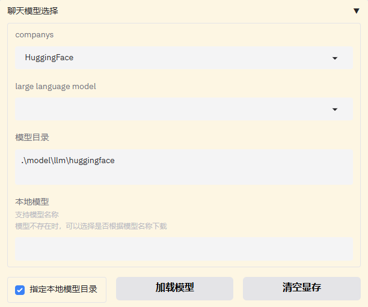

# RAG Assistant | Personal Knowledge Base Assistant

<div align="center">

</div>


<div align="center">

[](https://www.python.org/downloads/)
[](https://langchain.com/)
[](https://gradio.app/)
[](https://fastapi.tiangolo.com/)
[](LICENSE)

**A Personal Knowledge Base Assistant Supporting Cloud APIs and Local Models**
</div>

**Language | 语言**:

 [ English | [中文](README_ZH.md) ]

---

## 1 📖 Project Overview

**RAG Assistant** is a comprehensive personal knowledge base assistant built on **LangChain and LangGraph**. Although it's named **RAG Assistant**, during later development many features were added: multi-turn chat, web search, tool invocation, agent mode, and more. **RAG Assistant** provides a unified interface for large language model APIs and supports both cloud and local model deployment.


**Core highlight: An LLM application integrating Retrieval, Tools, and Memory**

- 🚀 **Flexible sign-in**: Support both registered users and quick guest access
- 🎨 **Visual UI**: Gradio-based web interface with light/dark themes
- 🎯 **Multiple modes**: Chat mode, Agent mode (ReAct Agent), Task-specific mode
- **Multi-turn conversation**: Preserve and adjust chat parameters dynamically
- 🚀 **Multiple model backends**: Both LLMs and embedding models support API and local invocation
- 🧠 **RAG optimization**: High-accuracy RAG built with **LangChain and Chroma**
- 🔧 **LangGraph Agent Framework**: Built-in agent features with custom tool integration
- 📚 **Knowledge base management**: Comprehensive document ingestion (docx, txt, pdf, markdown) and Chroma vector DB management
- 🎓 **LlamaFactory fine-tuning**: Integrated fine-tuning, deployment, and validation workflow
- 🔧 **Custom system prompts**: User-defined prompts for personalized LLM applications
- 🔍 **Project tracing**: Supports LangSmith to trace LLM application runs

## 2 ✨ Features

### 2.1 Core Features

**1. User Interface**

- **Web UI**: Modern responsive UI built with Gradio
- **User management**: Login/registration, guest access. Each registered user has an isolated database and can use their own API Keys; guests share the default backend key. By default, the backend-provided key is used for guests.
- **Theme support**: Light and dark modes

**2. Rich Chat Configuration**

- **Tool integration**: Custom Python functions and LangChain tools are supported (**For local models, tool-calling is supported only with Ollama**)
- **Multiple operation modes**: Chat mode, Agent mode, and Task-specific mode
  - Chat mode uses a LangChain-based workflow
  - Agent mode is built on LangGraph
  - Task-specific mode aims at dedicated LLM apps; currently supports Text Summarization. Depending on document length, it dynamically chooses between stuff, refine, and map_reduce

- **Web search**: Built-in web search; set `SERP_API_KEY` in the `.env` file
- **Memory management**: Conversation history and context retention
- **Document upload**: Use uploaded files as model context
- **Deep thinking**: Toggle between thinking and non-thinking modes for supported models **(for local models, this is currently supported only for the Qwen3 series)**

**3. Multi-Model Integration**

- **Cloud APIs**: OpenAI GPT, Baidu Wenxin, iFlytek Spark, ZhipuAI GLM, etc. Configure `API_KEY` and `BASE_URL` in the `env` file
- **Local models**: Support for Transformers, Ollama, llama.cpp with quantization options
- **Quantization options**: Local models provide quantization settings (**experimental**; for Transformers quantized models, there may be abnormal VRAM usage or incomplete VRAM release)
- **Unified interface**: Seamless switching among providers
- **Custom configs**: Fine-grained parameter tuning per model
- **Model downloads**: Download via ModelScope and Ollama

**4. Advanced RAG System**

- **Vector database**: Knowledge storage powered by Chroma
- **Document processing**: Supports PDF, TXT, MD, and DOCX
- **Retrieval strategies**: Quick Search and Advanced Search (optimized RAG) to balance recall efficiency and precision. Advanced Search improves RAG via multi-query expansion, re-ranking, context compression, and hybrid retrieval
- **Embedding models**: Multiple providers (OpenAI, ZhipuAI, etc.) and local models (HuggingFace and Ollama)
- **Retrieval configuration**: Choose retrieval algorithm, number of returned docs, score thresholds, and designated sources
- **Retrieval transparency**: Visualize RAG similarity scores, return source documents and retrieved chunks

**5. Knowledge Base Management**

- **File upload**: Drag-and-drop uploads
- **Database management**: Create, update, and delete knowledge bases
- **Search**: File search and filtering
- **Batch ops**: Bulk operations and management

**6. Other Features**

- **LLaMA-Factory integration**: Built-in fine-tuning UI. Locally fine-tuned models with LLaMA-Factory can be deployed and validated in RAG Assistant

- **Custom system prompts**: User-defined prompts for personalization
- **LangSmith project tracing**: Configure LangSmith variables in `.env` to enable tracing

## 3 🎬 Demos

**Main features:**

1. **Chat Mode**

   + **Deep Thinking and Web Search**
     <video src="./figures/chat_demo.mp4"></video>
   + **RAG**

     + Visual knowledge base management with UI CRUD
     + Quick Search using cosine similarity or MMR for vector matching
     + Advanced Search with multi-query rewriting and hybrid retrieval (text + vector). Initial recall results are improved via re-ranking and context compression. Re-ranking supports both cross-encoder (local) and LLM reranking

     <video src="./figures/rag_demo.mp4"></video>

2. **Task-specific Mode**

   - **Text Summarization**
     - Batch upload for generating summaries
     - Long document support. Short documents are fed directly as context; for long documents, refine and map-reduce are considered, calling LLM multiple times to compose the final summary

   <video src="./figures/abstract_demo.mp4"></video>

3. **Agent Mode**

   - **Reasoning and Planning**

     <video src="./figures/agent_demo.mp4"></video>

## 4🚀 Quick Start

### 4.1 Requirements

- Python 3.12
- GPU support (optional, for accelerating local models)
- Windows OS

### 4.2 Installation

**1. Clone the repository**

```bash
git clone https://github.com/chenxf85/RAG_Assistant.git
cd RAG_Assistant
```

**2. Install dependencies**

```bash
# Create a virtual environment:
conda create -n env_name python==3.12
conda activate env_name

# Install PyTorch (optional, choose the CUDA build matching your system)
pip3 install torch torchvision --index-url https://download.pytorch.org/whl/cu128

# Install Python dependencies
pip install -r requirements.txt
```

**3. Install local model runtimes (optional)**

+ **Ollama** (**recommended**)
  Visit the [Ollama download page](https://ollama.com/download) and install the Windows version

+ **llama-cpp-python**

  + Install Visual Studio 2022

    Select Desktop Development. You can also follow the component guidance in the [llama.cpp GitHub](https://github.com/ggml-org/llama.cpp/blob/master/docs/build.md).

  + **(CUDA acceleration)** Install the matching CUDA Toolkit (enable Visual Studio integration). **Note**: VS2022 requires CUDA >= 12.4. If your CUDA version is too low, you may use VS2019; alternatively, upgrade the NVIDIA driver and install a newer CUDA Toolkit.

    ```makefile
    # Configure environment variables in Path; add CUDA's bin and libnvvp folders, e.g.:
    C:\\Program Files\\NVIDIA GPU Computing Toolkit\\CUDA\\v12.8\\bin
    C:\\Program Files\\NVIDIA GPU Computing Toolkit\\CUDA\\v12.8\\libnvvp
    ## (If not added automatically) add environment variables CUDA_PATH and CUDA_PATH_V<version>:
    CUDA_PATH = C:\\Program Files\\NVIDIA GPU Computing Toolkit\\CUDA\\v12.8
    CUDA_PATH_V12_8 = C:\\Program Files\\NVIDIA GPU Computing Toolkit\\CUDA\\v12.8 
    ```

  + Install llama-cpp-python:
    In PowerShell:

    + CUDA build:
      ``` powershell
      $env:CMAKE_ARGS = "-DGGML_CUDA=ON"
      pip install llama-cpp-python==0.3.12 --upgrade 
      ```

    + CPU build:

      ``` powershell
      pip install llama-cpp-python --upgrade 
      ```

**4. Install fine-tuning framework (optional)**

+ **LLaMA-Factory installation**:
  [GitHub - hiyouga/LLaMA-Factory](https://github.com/hiyouga/LLaMA-Factory)

  ```cmd
  git clone --depth 1 https://github.com/hiyouga/LLaMA-Factory.git
  cd LLaMA-Factory
  pip install -e ".[torch,metrics]" --no-build-isolation
  ```

**5. Configure API Keys**

Create a `.env` file at the project root:

```bash
# LLM API keys (for cloud models)
OPENAI_API_KEY=your_openai_api_key
OPENAI_BASE_URL=your_openai_url
ZHIPUAI_API_KEY=your_zhipuai_api_key
ZHIPUAI_BASE_URL=your_zhipuai_url

# LangSmith API key (optional; skip if you do not need tracing)
LANGSMITH_TRACING="true"
LANGSMITH_ENDPOINT="https://api.smith.langchain.com"
LANGSMITH_API_KEY=your_api_key
LANGSMITH_PROJECT=your_project_name

# Web search API key
SERP_API_KEY=your_serpapi_key
```

To protect key privacy, the provided `.env` keeps only an example `OPENAI_API_KEY` and `SERP_API_KEY` for testing. **Note**: the provided `OPENAI_API_KEY` comes from the free API of [GPT_API_free](https://github.com/chatanywhere/GPT_API_free) and has daily quota limits. If you want to use official OpenAI models, please update `API_KEY` and `BASE_URL` accordingly.

### 4.3 Run the app

```bash
# Launch the Gradio web UI
cd project
python serve/run_gradio.py
```

Visit: `http://localhost:7860`

## 5 📁 Project Structure

```
── project/                          # Main project code
│   ├── Agent/                        # Agent framework
│   │   ├── agent.py                  # ReAct agent
│   │   └── tools.py                  # Built-in/custom tools
│   ├── database/                     # Vector DB and file indexing
│   │   ├── create_db.py              # Knowledge base create/update/delete
│   │   ├── gen_files_list.py         # File manifest (SQLite)
│   │   └── vector_data_base/         # Per-user vector DB persistence
│   ├── embedding/                    # Embedding model integration
│   │   ├── call_embedding.py         # Unified embedding API (cloud/local)
│   │   └── HuggingFaceEmbeddings2.py # Local HF embeddings
│   ├── llm/                          # Text generation model integration
│   │   └── call_llm.py               # Read API key and base URL
│   │   └── model_to_llm.py           # Unified LLM API (cloud/local)
│   ├── qa_chain/                     # RAG chains and retrieval flows
│   │   ├── Chat_QA_chain_self.py     # Core chat + retrieval chain
│   │   ├── File_Browse_Chain.py      # Document summarization chain
│   │   ├── MapReduceChain.py         # Map-Reduce summarization
│   │   └── Refine_chain.py           # Refine summarization
│   ├── serve/                        # Web app and entry points
│   │   ├── run_gradio.py             # Gradio UI entry
│   │   └── run_rag_assistant.py      # Rag_assistant main page
│   ├── user/                         # Users and authentication
│   │   ├── MyBlocks.py               # Login/registration/app blocks
│   │   ├── log_in.py                 # Login module
│   │   ├── sign_up.py                # Registration module
│   │   └── users.json                # Demo user data
│   ├── utils/                        # Utilities and helpers
│   │   ├── checkPort.py              # Dynamic port selection
│   │   ├── ensembleRetriever.py      # Hybrid retrieval wrapper
│   │   ├── fileProcess.py            # Document parsing and splitting
│   │   ├── formatPackage.py          # Rendering/formatting
│   │   ├── replace_think_tag.py      # Reasoning tag cleanup
│   │   └── reranker.py               # LLM/cross-encoder reranking
│   ├── model/                        # Local models and resources
│   │   ├── llm/                      # Local LLMs (HuggingFace/Ollama/llama.cpp)
│   │   ├── embedding/                # Local embedding models
│   │   └── reranker/                 # Cross-encoder rerankers
│   ├── prompt/                       # Prompt templates
│   │   └── prompt.py                 # System prompts
│   ├── fine_tuning/                  # Fine-tuning and datasets
│   │   └── datasets/                 # Example/test data
│   ├── globals.py                    # Global config and caches
│   └── requirements.txt              # Python dependencies
├── figures/                          # Images and demo assets
├── cache/                            # Cache (distributed/VRAM strategy)
├── LICENSE                           # License
└── README_zh.md                      # Chinese README
```

## 6 🔧 Configuration

### 6.1 Cloud model configuration

+ Configure `API_KEY` and `BASE_URL` in the `.env` file. Use the naming pattern `PROVIDER_API_KEY` and `PROVIDER_BASE_URL`, following the examples in the file

+ Configure model lists in `globals`:

  + `LLM_MODEL_DICT`, `EMBEDDING_MODEL_DICT`, and `LLM_MODEL_MAXTOKENS_DICT` specify text model names, embedding model names, and each text model's maximum output length and context window

  + **Text model configuration**

    ```python
    # Supported model types
    LLM_MODEL_DICT = {
        "OPENAI": ["gpt-3.5-turbo", "gpt-4o-mini",
                   "gpt-4.1-mini","gpt-4.1-nano","gpt-5-mini","gpt-5-nano",
                   "gpt-4o","gpt-4.1","gpt-5" 
                   ],
        "WENXIN": [" ernie-tiny-8k","ernie-lite-8k","ernie-speed-128k",
                 "ernie-4.0-8k-latest","ernie-4.0-turbo-128k","ernie-4.5-turbo-128k",
                    "ernie-x1-32k","ernie-x1-turbo-32k"
                  ], 
        ...
    }
    # Max output tokens and context window
    LLM_MODEL_MAXTOKENS_DICT = {
        "OPENAI": {"gpt-3.5-turbo": [4096, 16384], ...},
        "ZHIPUAI": {"glm-4": [8192, 32768], ...},
        "WENXIN": {"ernie-bot": [4096, 16384], ...},
        "SPARK": {"spark-3.0": [4096, 16384], ...},
        "HuggingFace": {"THUDM/chatglm3-6b": [8192, 32768], ...},
        "Ollama": {"llama2:7b": [4096, 16384], ...}
    }
    ```

  + **Embedding model configuration**

    ```python
    EMBEDDING_MODEL_DICT = {
        "OPENAI": ["text-embedding-ada-002", "text-embedding-3-small"],
        "ZHIPUAI": ["embedding-2"],
        "WENXIN": ["embedding-v1"],
        "SPARK": ["spark-embedding-v1"]
    }
    ```

### 6.2 Local model configuration

+ Local models do not require API keys; just provide the download paths. **Default download directories:**

```
│   ├── model/                        # Local models and resources
│   │   ├── llm/                      # Local LLMs (HuggingFace/Ollama/llama.cpp)
│   │   │   ├──Ollama/                # Ollama local models
│   │   │   ├──HuggingFace/           # HuggingFace local models (safetensors)
│   │   │   ├──llama_cpp/             # llama.cpp local models (gguf)
│   │   ├── embedding/                # Local embedding models
│   │   │   ├──Ollama/                # Ollama embeddings
│   │   │   ├──HuggingFace/           # HuggingFace embeddings
│   │   └── reranker/                 # Cross-encoder rerankers
```

Just place the model folders under the specified directories.

+ **Custom download directories:**
  Two options are provided:

  + Modify `default_model_dir` in the `globals` file

    ```python
    default_model_dir={"HuggingFace":"model/llm/HuggingFace","Ollama":"model/llm/Ollama","llama_cpp":"model/llm/llama_cpp",
                       "HuggingFaceEmbedding":"model/embedding/HuggingFace","OllamaEmbedding":"model/embedding/Ollama"}
    ```

  + Modify in the UI: set the model download directory in the interface; press Enter to refresh the model list in that path

    

## 7 📄 License

This project is licensed under the MIT License - see the [LICENSE](LICENSE) file for details.

## 8 🙏 Acknowledgements

- [DataWhale](https://datawhalechina.github.io/llm-universe/) - Original tutorial inspiration
- [LLaMA-Factory](https://github.com/hiyouga/LLaMA-Factory/tree/main) - Fine-tuning framework support
- [GPT_API_free](https://github.com/chatanywhere/GPT_API_free) - Free OpenAI API support

## 9 📞 Support
- **Issues**: [GitHub Issues](https://github.com/chenxf85/RAG_Assistant/issues)
- **Email**: 225010222@link.cuhk.edu.cn

---

<div align="center">
**⭐ If this project is helpful, please give it a star! ⭐**

</div>

