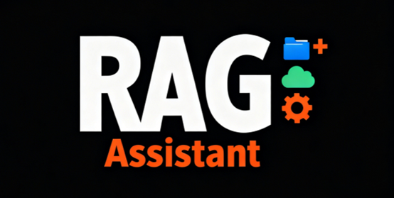
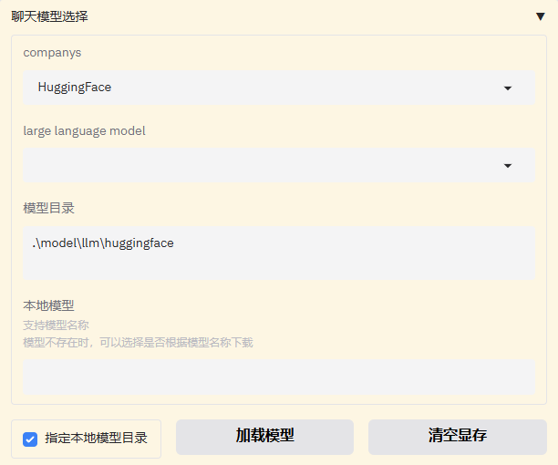

# RAG Assistant | 个人知识库助手

<div align="center">

</div>
#                       支持大模型API和本地模型的个人知识库助手

<div align="center">

[](https://www.python.org/downloads/)
[](https://langchain.com/)
[](https://gradio.app/)
[](https://fastapi.tiangolo.com/)
[](LICENSE)


****

**Language | 语言**:

[ [English](./README.md) | 中文]

---

## 1 📖 项目简介

**RAG Assistant** 是一个基于 **LangChain 和LangGrpah**构建的综合个人知识库助手。尽管他命名为**RAG Assistant,**但在开发后期我为它增加了许多功能：包括多轮对话，联网搜索，工具调用，智能体模式等等。**RAG Assistant**为大语言模型 API 提供统一接口，支持云端和本地模型部署。


**核心亮点：集成了Retrival,Tools 和Memory的LLM应用**

- 🚀**可选登录方式**：灵活的注册访问与快速游客访问： 
- 🎨 **可视化界面**：Gradio网页展示，直观的网页界面，支持深色/浅色主题
- 🎯**多模式选择**：支持聊天模式，智能体模式（React Agent），指定模式。
- **多轮对话：** 支持多轮对话，动态调整聊天参数
- 🚀 **多模型支持**：大模型和嵌入模型都支持API调用和本地调用.
- 🧠 **RAG优化**：基于**Langchain和Chroma**的高精度的RAG。
- 🔧 **LangGraph智能体框架**：内置智能体功能，支持自定义工具集成
- 📚 **知识库管理**：全面的文档处理（支持docx,txt,pdf,markdown文件上传）和Chroma向量数据库管理。
- 🎓**LlamaFactory微调**：集成了llamaFactory应用，实现微调-部署-验证一站式服务。
- 🔧**自定义系统提示词**：支持用户自定义prompt，打造个性化LLM应用。
- 🔍**项目跟踪**：支持Langsmith检测LLM应用过程

## 2 ✨ 功能介绍

### 2.1 核心功能

**1. 用户界面**

- **网页界面**：基于 Gradio 的现代响应式 UI
- **用户管理**：登录/注册系统，支持访客访问。不同的用户的数据库独立，允许使用自身的apikey；访客不单独维护数据库。默认使用后台提供的key
- **主题支持**：深色和浅色模式主题

**2. 丰富的聊天配置**

- **工具集成**：支持自定义 Python 函数和 LangChain 工具 （**本地模型仅ollama模型支持工具调用**）
- **多模式操作**：聊天模式、智能体模式和自定义模式。
  - 聊天模式基于langchain构建workflow,
  - 智能体模式基于Langgraph搭建agent
  - 自定义模式的目标是实现特定的LLM应用，当前仅支持文本摘要。根据上传的文档长度，动态调整摘要生成方式（stuff,refine和map_reduce）

- **网络搜索**：集成的网络搜索功能,需要在```.env```文件配置SERP_API_KEY
- **记忆管理**：对话历史和上下文保留
- **文档上传**：支持上传文档作为模型的上下文
- **深度思考**：对于混合思考模型支持和非思考和思考模式切换**（对于本地模型，该功能仅支持Qwen3系列模型）**

**3. 多模型集成**

- **云端API**：OpenAI GPT、百度文心、讯飞星火、智谱AI GLM等模型，需要在```env```文件中配置API_KEY 和Base_URL.
- **本地模型**：提供了Transformers、Ollama、llama.cpp 支持，支持量化。
- **量化选项**：本地模型提供了量化配置（**该功能处于测验阶段**，**transforemer 量化模型可能存在显存占用异常，显存释放不彻底的问题**）
- **统一接口**：不同模型提供商之间的无缝切换
- **自定义配置**：每个模型的灵活参数调优
- **模型下载**：支持通过modelscope和ollama下载模型

**4. 高级RAG系统**

- **向量数据库**：基于 Chroma 的知识存储
- **文档处理**：支持 PDF、TXT、MD、DOCX 格式
- **可选的检索方式**：快速搜索和高级搜索（优化的RAG）,实现检索效率和精度的平衡。高级检索通过多查询，重排，上下文压缩，混合检索的方式优化RAG的效果。
- **嵌入模型**：多种嵌入提供商（OpenAI、智谱AI等）和本地嵌入模型（HuggingFace和Ollama)
- **检索配置**：可选RAG检索参数包括检索算法，返回文档数量，分数阈值，指定检索文档。
- **检索准确性**： 可视化RAG召回得分，支持返回源文档和检索的片段 。

**5. 知识库管理**

- **文件上传**：拖放文件上传界面
- **数据库管理**：创建、更新和删除知识库
- **搜索功能**：文件搜索和过滤功能
- **批量操作**：批量文件操作和管理

**6. 其他功能**

- **LLaMA Factory 集成**：内置微调界面。用户可以将llamafactory微调的本地模型，在Rag Assistant中部署，验证模型性能

- **自定义系统提示词**：支持用户自定义prompt，打造个性化LLM应用。
- **Langsmith项目跟踪**：支持Langsmith检测LLM应用过程，需要在```.env``文件配置Langsmith相关环境变量


## 3 🎬 项目演示

**主要功能展示：**

1. **聊天模式**

   + **深度思考与联网搜素**

     <video src=".\figures\chat_demo.mp4"></video>

   + **RAG**

     + 可视化文档知识库管理，UI实现知识库的增删改查
     + 支持快速搜索，基于余弦相似度或者MMR算法匹配文本向量
     + 支持高级搜索，使用多重查询改写用户问题，采用文本和向量的混合检索。对于初步召回结果，采用重排序和上下文压缩的方法，提高检索的精度。重排序分为交叉编码器重排（本地）和LLM重排。

     <video src=".\figures\rag_demo.mp4"></video>

2. **指定模式**

   - **文本摘要**
     - 支持文档批量上传，生成摘要
     - 支持长文档的摘要生成。短文档直接将文本作为上下文；对于长文档，会考虑refine和map-reduce方法，多次调用LLM，生成摘要。

   <video src=".\figures\abstract_demo.mp4"></video>

3. **智能体模式**

   - **思考与推理**

     <video src=".\figures\agent_demo.mp4"></video>

## 4🚀 快速开始

### 4.1 环境要求

- Python 3.12
- GPU 支持（可选，用于本地模型加速）
- Windows系统

### 4.2 安装步骤

**1. 克隆仓库**

```bash
git clone https://github.com/your-username/RAG_Assistant.git
cd RAG_Assistant
```

**2. 安装依赖

```bash
#创建虚拟环境：
conda create -n env_name python==3.12
conda activate env_name


# 安装pytorch（可选，下载对应cuda版本的pytorch）
pip3 install torch torchvision --index-url https://download.pytorch.org/whl/cu128

# 安装 Python 依赖
pip install -r requirements.txt
```

**3. 本地模型框架安装（可选）**

+ **Ollama** (**推荐使用**)
  进入[Ollama安装官网](https://ollama.com/download)下载Windows版本

+ **llama-cpp-python**

  + 安装VS2022

    勾选桌面开发即可。也可以按照[llama.cpp Github](https://github.com/ggml-org/llama.cpp/blob/master/docs/build.md)要求安装VS组件。

  + **（Cuda加速）**安装对应版本的Cuda Toolkit(勾选Visual Studio intergration).**注意**，VS2022需要cuda >=12.4.如果cuda版本过低，可以选择VS2019;或者，升级nvidia驱动后，重新下载高版本的cuda toolkkit.

    ```makefile
    #配置环境变量Path,在Path中加入Cuda安装目录下的bin和libnvvp文件夹，例如:
    C:\Program Files\NVIDIA GPU Computing Toolkit\CUDA\v12.8\bin
    C:\Program Files\NVIDIA GPU Computing Toolkit\CUDA\v12.8\libnvvp
    ##（如果安装完成后没有自动添加）新增环境变量,CUDA_PATH和CUDA_PATH_V版本号设置为Cuda安装目录，例如：
    CUDA_PATH = C:\Program Files\NVIDIA GPU Computing Toolkit\CUDA\v12.8
    CUDA_PATH_V12_8 = C:\Program Files\NVIDIA GPU Computing Toolkit\CUDA\v12.8 
    ```

  + 安装llama-cpp-python:
    在powershell中输入：

    + Cuda加速:
      ``` powershell
      $env:CMAKE_ARGS = "-DGGML_CUDA=ON"
      pip install llama-cpp-python==0.3.12 --upgrade 
      ```

    + CPU版本：

      ``` powershell
      pip install llama-cpp-python --upgrade 
      ```

      

**4.微调框架安装（可选）**

+ **llama-factory安装**:
  [GitHub - hiyouga/LLaMA-Factory: Unified Efficient Fine-Tuning of 100+ LLMs & VLMs (ACL 2024)](https://github.com/hiyouga/LLaMA-Factory)

  ```cmd
  git clone --depth 1 https://github.com/hiyouga/LLaMA-Factory.git
  cd LLaMA-Factory
  pip install -e ".[torch,metrics]" --no-build-isolation
  ```

  

**5. API KEY配置**

在项目根目录创建 `.env` 文件：

```bash
# 大模型API 密钥（用于云端模型）
OPENAI_API_KEY=your_openai_api_key
OPENAI_BASE_URL=your_openai_url
ZHIPUAI_API_KEY=your_zhipuai_api_key
ZHIPUAI_BASE_URL=your_zhipuai_url


# Langsmith API key(可选，如果不需要项目跟踪可以不配置)

LANGSMITH_TRACING="true"
LANGSMITH_ENDPOINT="https://api.smith.langchain.com"
LANGSMITH_API_KEY=your_api_key
LANGSMITH_PROJECT=your_project_name

#联网搜索API Key
SERP_API_KEY=your_serpapi_key

```

为了保证密钥隐私性，```.env```文件只保留一个OPENAI_API_KEY，SERP_API_KEY用于测试。**注意**:项目提供的OPENAI_API_KEY来自[GPT_API_free](https://github.com/chatanywhere/GPT_API_free)的免费API_KEY,每天有一定额度限制；如果想要使用官方的OpenAI模型，需要修改API_KEY和BASE_URL

### 4.3 启动应用

```bash
# 启动 Gradio 网页界面
cd project
python serve/run_gradio.py
```

访问界面：`http://localhost:7860`

## 5 📁 项目结构

```
── project/                          # 主要项目代码
│   ├── Agent/                        # 智能体框架
│   │   ├── agent.py                  # ReAct 智能体
│   │   └── tools.py                  # 内置/自定义工具
│   ├── database/                     # 向量数据库与文件索引
│   │   ├── create_db.py              # 知识库创建/更新/删除
│   │   ├── gen_files_list.py         # 文件清单管理 (SQLite)
│   │   └── vector_data_base/         # 用户分区的向量库持久化
│   ├── embedding/                    # 嵌入模型集成
│   │   ├── call_embedding.py         # 统一嵌入接口(云端/本地)
│   │   └── HuggingFaceEmbeddings2.py # 本地HF嵌入支持
│   ├── llm/                          # 文本生成模型集成
│   │   └── call_llm.py               # 读取APIkey和Base url
│   │   └── model_to_llm.py           # 统一LLM接口(云端/本地)
│   ├── qa_chain/                     # RAG链路与检索流程
│   │   ├── Chat_QA_chain_self.py     # 核心聊天+检索链
│   │   ├── File_Browse_Chain.py      # 文档摘要链
│   │   ├── MapReduceChain.py         # Map-Reduce 摘要链
│   │   └── Refine_chain.py           # Refine 摘要链
│   ├── serve/                        # Web应用与启动入口
│   │   ├── run_gradio.py             # Gradio UI 主入口
│   │   └── run_rag_assistant.py      # Rag_assistant 主页面
│   ├── user/                         # 用户与登录管理
│   │   ├── MyBlocks.py               # 登录/注册/应用区块
│   │   ├── log_in.py                 # 登录模块
│   │   ├── sign_up.py                # 注册模块
│   │   └── users.json                # 演示用用户数据
│   ├── utils/                        # 工具与通用组件
│   │   ├── checkPort.py              # 动态端口分配
│   │   ├── ensembleRetriever.py      # 混合检索封装
│   │   ├── fileProcess.py            # 文档解析与切分
│   │   ├── formatPackage.py          # 渲染/格式化
│   │   ├── replace_think_tag.py      # 推理标签清洗
│   │   └── reranker.py               # LLM/交叉编码器重排
│   ├── model/                        # 本地模型与资源
│   │   ├── llm/                      # 本地LLM (HuggingFace/Ollama/llama.cpp)
│   │   ├── embedding/                # 本地嵌入模型
│   │   └── reranker/                 # 重排序交叉编码器模型
│   ├── prompt/                       # 提示词模板
│   │   └── prompt.py                 # 系统提示词
│   ├── fine_tuning/                  # 微调与数据集
│   │   └── datasets/                 # 示例与测试数据
│   ├── globals.py                    # 全局配置与缓存管理
│   └── requirements.txt              # Python 依赖
├── figures/                          # 项目图片与演示素材
├── cache/                            # 配置缓存(分布式/显存策略)
├── LICENSE                           # 许可证
└── README_zh.md                      # 中文说明
```

## 6 🔧 配置说明

### 6.1 云端模型配置

+ 在```.env```文件中配置API_KEY和Base_URL,命名规则是```模型厂商_API_KEY```和```模型厂商_BASE_URL```,参考文件中其他模型的命名规则

+ globals文件中配置模型列表：

  + ```LLM_MODEL_DICT,EMBEDDING_MODEL_DICT,LLM_MODEL_MAXTOKENS_DICT``分别配置文本模型名称，嵌入模型名称和文本模型最大输出长度和最大上下文窗口。

  + **文本模型配置**

    ```python
    # 支持的模型类型
    LLM_MODEL_DICT = {
        "OPENAI": ["gpt-3.5-turbo", "gpt-4o-mini",
                   "gpt-4.1-mini","gpt-4.1-nano","gpt-5-mini","gpt-5-nano",
                   "gpt-4o","gpt-4.1","gpt-5" 
                   ],
        "WENXIN": [" ernie-tiny-8k","ernie-lite-8k","ernie-speed-128k",
                 "ernie-4.0-8k-latest","ernie-4.0-turbo-128k","ernie-4.5-turbo-128k",
                    "ernie-x1-32k","ernie-x1-turbo-32k"
                  ], 
        ...
    }
    #模型最大输出和上下文窗口长度
    LLM_MODEL_MAXTOKENS_DICT = {
        "OPENAI": {"gpt-3.5-turbo": [4096, 16384], ...},
        "ZHIPUAI": {"glm-4": [8192, 32768], ...},
        "WENXIN": {"ernie-bot": [4096, 16384], ...},
        "SPARK": {"spark-3.0": [4096, 16384], ...},
        "HuggingFace": {"THUDM/chatglm3-6b": [8192, 32768], ...},
        "Ollama": {"llama2:7b": [4096, 16384], ...}
    }
    ```

  + **嵌入模型配置**

    ```python
    EMBEDDING_MODEL_DICT = {
        "OPENAI": ["text-embedding-ada-002", "text-embedding-3-small"],
        "ZHIPUAI": ["embedding-2"],
        "WENXIN": ["embedding-v1"],
        "SPARK": ["spark-embedding-v1"]
    }
    ```

### 6.2 本地模型配置

+ 本地模型不需要API_KEY,只需要指定模型下载路径即可。**默认下载路径是:**

```
│   ├── model/                        # 本地模型与资源
│   │   ├── llm/                      # 本地LLM (HuggingFace/Ollama/llama.cpp)
│   │   │   ├──Ollama/                #Ollama本地模型
│   │   │   ├──HuggingFace/           #HuggingFace本地模型(safetensors格式)
│   │   │   ├──llama_cpp/             #llama.cpp本地模型(guff格式)
│   │   ├── embedding/                # 本地嵌入模型
│   │   │   ├──Ollama/                #Ollama本地嵌入模型
│   │   │   ├──HuggingFace/           #HuggingFace本地嵌入模型
│   │   └── reranker/                 # 重排序交叉编码器模型

```

只需要将模型文件夹下载在指定目录即可。

+ **自定义下载目录：**
  提供了两种方式供用户选择：

  + 修改globals文件下的default_model_dir变量

    ```python
    default_model_dir={"HuggingFace":"model/llm/HuggingFace","Ollama":"model/llm/Ollama","llama_cpp":"model/llm/llama_cpp",
                       "HuggingFaceEmbedding":"model/embedding/HuggingFace","OllamaEmbedding":"model/embedding/Ollama"}
    ```

  + 在UI处可以修改，可以指定模型下载目录；回车既可以刷新该路径下的模型列表。

    

    

## 7 📄 许可证

本项目采用 MIT 许可证 - 详情请参阅 [LICENSE](LICENSE) 文件。

## 8 🙏 致谢

- [DataWhale](https://datawhalechina.github.io/llm-universe/) - 原始教程灵感
- [LLaMA-Factory]([GitHub - hiyouga/LLaMA-Factory: Unified Efficient Fine-Tuning of 100+ LLMs & VLMs (ACL 2024)](https://github.com/hiyouga/LLaMA-Factory/tree/main)):微调框架支持
- [GPT_API_free](https://github.com/chatanywhere/GPT_API_free):免费的OpenAI模型支持

## 9 📞 支持

- **问题反馈**：[GitHub Issues](https://github.com/your-username/RAG_Assistant/issues)
- **讨论交流**：[GitHub Discussions](https://github.com/your-username/RAG_Assistant/discussions)
- **邮箱联系**：225010222@link.cuhk.edu.cn

---

<div align="center">
**⭐ 如果这个项目对您有帮助，请给它一个星标！⭐**

</div>
